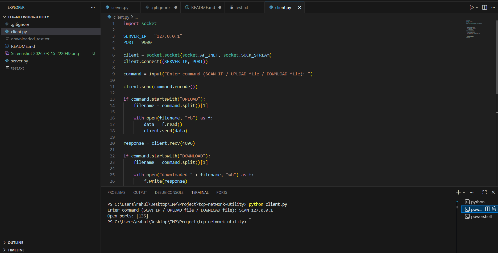

# TCP Network Utility

A lightweight networking utility built with **Python TCP sockets**.
This project demonstrates core networking concepts such as **client–server communication, port scanning, and file transfer over TCP**.

---

## Features

* TCP client-server communication
* Multi-threaded server handling multiple connections
* Port scanning for a target host
* File upload to the server
* File download from the server

---

## Demo



## Technologies Used

* Python 3
* TCP/IP
* Python `socket` module
* Python `threading` module

---

## Project Structure

```
tcp-network-utility
│
├── server.py      # TCP server handling client requests
├── client.py      # Client program to send commands
├── README.md      # Project documentation
└── .gitignore
```

---

## How It Works

1. The **server** listens for incoming TCP connections.
2. The **client** connects to the server and sends commands.
3. The server processes the request and sends the result back to the client.

Supported commands:

```
SCAN <ip>
UPLOAD <filename>
DOWNLOAD <filename>
```

---

## Setup and Installation

Clone the repository:

```
git clone https://github.com/bhojkarahul/tcp-network-utility.git
```

Navigate into the project folder:

```
cd tcp-network-utility
```

---

## Running the Server

Start the server first:

```
python server.py
```

Expected output:

```
Server running on port 9000...
```

---

## Running the Client

Open another terminal and run:

```
python client.py
```

Then enter one of the supported commands.

---

## Example Usage

### Port Scan

```
SCAN 127.0.0.1
```

Example output:

```
Open ports: [135]
```

---

### Upload File

```
UPLOAD test.txt
```

---

### Download File

```
DOWNLOAD test.txt
```

Downloaded files will appear as:

```
downloaded_<filename>
```

---

## Networking Concepts Demonstrated

* TCP socket programming
* Client–server architecture
* Multi-threaded network servers
* Port scanning fundamentals
* File transfer over TCP

---

## Possible Improvements

* Add authentication for clients
* Improve command-line interface
* Add network diagnostics tools (ping, traceroute)
* Expand port scanning range and performance

---

## Author

Rahul Bhojkar
